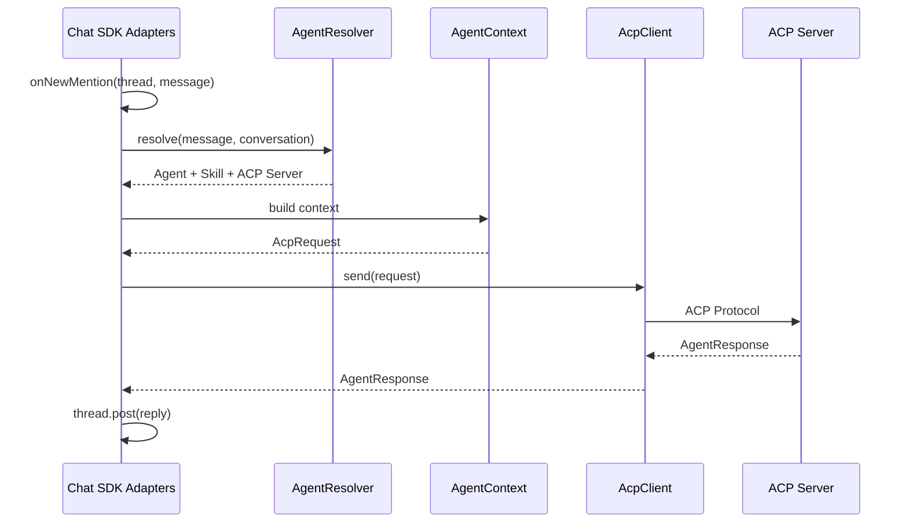
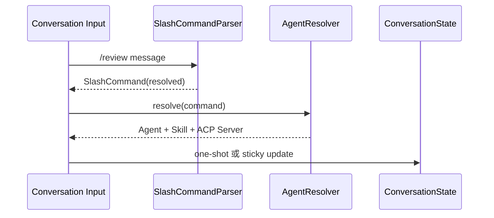
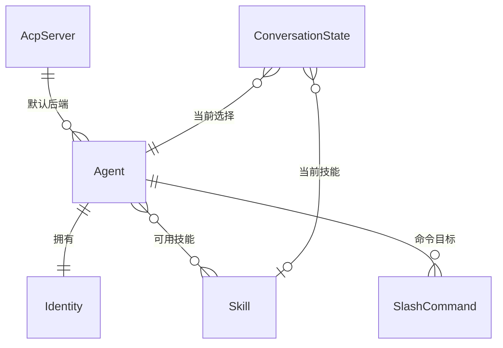

> **Status**: `draft`

# 架构总览：ACP-native Agent 控制平面

## § 架构定位

AgentLink 的架构服务于产品蓝图（`docs/blueprint.md`），三条产品边界直接决定架构边界：

1. **ACP-native** — 不自研 Agent Server，所有 Agent 执行通过 ACP 协议调用用户配置的 ACP Server。AgentLink 管"谁处理、用什么 Skill、何时切换"，ACP Server 管"如何执行"。
2. **Control plane** — 管理 Agent 角色、Skill、会话状态、默认 Agent 和 SlashCommand；不依赖任何特定 ACP Server 的内部配置。
3. **Messaging-native** — 通过 Chat SDK 把 Agent 接入 Feishu 等真实 IM 消息流；IM 渠道是场景，不是平台。

## § 三层能力模型

```
┌─────────────────────────────────────────────┐
│           Channel Adapter Layer              │
│  Chat SDK Adapters → Message → reply         │
│  Slack · Feishu · Discord · GitHub ...       │
├─────────────────────────────────────────────┤
│           Agent Control Layer                │
│  Agent · Identity · Skill · SlashCommand     │
│  AgentResolver · ConversationState           │
│  SlashCommandParser · Events                 │
├─────────────────────────────────────────────┤
│           ACP Integration Layer              │
│  AcpClient → ACP Server → AgentResponse      │
│  AgentContext · AcpServerRegistry            │
└─────────────────────────────────────────────┘
```

三层均运行在 Electron Main 进程（Node.js），通过 Chat SDK 的 `Chat` 实例接入多渠道适配器，在事件回调中编排 Agent 解析和 ACP 调用。

- **Channel Adapter Layer**：基于 Chat SDK 的 Adapter 体系（`Chat` + `adapters` + `state`）。Chat SDK 已提供 Slack、Feishu、Discord、GitHub 等多平台适配器，处理 webhook 验签、消息解析、格式化发送和线程管理（`thread.subscribe()` / `thread.post()`）。AgentLink 注册所需适配器即可接入渠道，不重新实现协议适配逻辑。
- **Agent Control Layer**：AgentLink 自建层。管理 Agent/Skill/SlashCommand 和会话状态。Chat SDK 的 `onNewMention` 和 `onSubscribedMessage` 回调中执行 SlashCommand 解析 → AgentResolver 选择 Agent → 组装 AgentContext → 调用 AcpClient，处理完毕后通过 `thread.post()` 回复。同一 `channel + conversation_id` 内按 FIFO 保序处理。
- **ACP Integration Layer**：通过 AcpClient 调用外部 ACP Server。Chat SDK 的 `thread.post()` 直接支持传入 AI SDK 的 `textStream`，可用于流式返回 Agent 响应。

Events 是进程内轻量机制（Node.js EventEmitter + oRPC streaming），用于解耦日志、审计和 UI 状态推送。Desktop UI 运行在独立的 Renderer 进程，通过 oRPC IPC 与 Main 进程通信。

## § 约束与部署

- AgentLink 全部业务逻辑运行在 Electron Main 进程内，不创建独立 daemon 或 sidecar。窗口关闭到托盘后（Electron Tray API）继续运行；用户显式退出（`app.quit()`）后停止。
- Desktop UI 通过 oRPC IPC 访问 Main 进程，不直接调用 Chat SDK、AgentResolver 或 Events 内部结构。
- 渠道适配、webhook 验签、消息格式化和线程管理由 Chat SDK 提供，AgentLink 不重新实现。
- 密钥通过 `electron.safeStorage` 加密存储（macOS Keychain / Windows DPAPI）。
- 打包分发通过 Electron Forge（Squirrel / ZIP / RPM / DEB + GitHub publisher）。
- 公网 Webhook 入口需要 Cloud Relay、tunnel 或用户自建 HTTPS endpoint。

## § 关键设计决策

| 决策问题 | 选择 | 放弃的替代方案 | 理由 |
|---------|------|--------------|------|
| AgentLink 是否自研 Agent Server？ | 不自研，复用用户 ACP Server | 自研 Agent runtime | 聚焦控制平面，少造轮子 |
| 入站消息如何保序？ | Chat SDK 线程模型 + 回调内 FIFO | MessageBus 直连上下游 | Chat SDK 已提供 `onNewMention` / `onSubscribedMessage` 线程分发 |
| Agent 如何选择？ | 默认 Agent + SlashCommand 显式选择 | RouteRule 自动路由 | 显式命令比关键词规则更可解释 |
| v1 后台模型？ | Electron Main 进程内驻留 Chat SDK + Agent/ACP 逻辑 | 独立 OS daemon | Main 进程常驻满足托盘场景，无需额外进程 |
| IPC 实现方式？ | oRPC over MessagePort | ipcMain.handle / ipcRenderer.invoke | 类型安全、Zod 校验、middleware 上下文注入 |
| 凭证加密方案？ | electron.safeStorage | keytar 或明文 localStorage | 内置 Electron，OS 原生加密，无额外依赖 |

## § 边界划分

```
Electron App
  ├─ Main Process (Node.js)
  │    ├─ App lifecycle
  │    ├─ oRPC Server（over MessagePort）
  │    │    ├─ rpcHandler.upgrade(serverPort)
  │    │    ├─ IPC context（BrowserWindow 引用 → oRPC middleware）
  │    │    └─ Router（theme / window / app / shell / agent / channel / ...）
  │    ├─ Chat SDK `Chat` 实例（多渠道适配器编排）
  │    │    ├─ Adapters（Slack / Feishu / Discord / GitHub ...）
  │    │    ├─ Webhook handler（验签 + 消息解析）
  │    │    └─ Thread（`subscribe()` / `post()` / `textStream`）
  │    ├─ Agent Control Layer
  │    │    ├─ Agent / Identity / Skill / SlashCommand
  │    │    ├─ AgentResolver · ConversationState
  │    │    └─ Events（Node.js EventEmitter）
  │    ├─ ACP Integration Layer
  │    │    ├─ AgentContext · AcpClient · AcpServerRegistry
  │    │    └─ ToolExecutor
  │    ├─ Storage / Config / safeStorage
  │    ├─ Tray（窗口关闭后维持 Main 进程运行）
  │    └─ Auto-updater（update-electron-app）
  │
  ├─ Preload Script（contextIsolation 桥接）
  │    └─ MessagePort 转发：window.postMessage ↔ ipcRenderer.postMessage
  │
  └─ Renderer Process（BrowserWindow / Chromium）
       ├─ React App（TanStack Router + TanStack Query + shadcn-ui）
       ├─ IPC Manager（oRPC client over MessagePort → ipc.client）
       └─ Actions Layer（ipc.client.<domain>.<method>() 薄封装）
```

## § IPC 模式

项目已有的 oRPC over MessagePort 模式（当前 `theme`、`window`、`app`、`shell`）自然映射到新领域：

```
src/ipc/
  ├─ theme/   window/   app/   shell/     ✓ 已实现
  ├─ agent/         — Agent CRUD, AgentResolver
  ├─ skill/         — Skill CRUD, Agent-Skill 关联
  ├─ channel/       — Chat SDK 适配器启用/禁用, 配置
  ├─ session/       — ConversationState
  ├─ slashcommand/  — SlashCommand 注册与解析
  ├─ acp/           — AcpServerRegistry, AcpClient 状态
  └─ events/        — Events 流式订阅（oRPC streaming）
```

每个领域遵循统一结构：`index.ts`（导出分组）、`handlers.ts`（`os.handler()` 过程定义）、`schemas.ts`（Zod 校验）。Renderer 侧通过 `src/actions/<domain>.ts` 调用 `ipc.client.<domain>.<method>()`。

## § 核心流程

### 主流程：渠道消息 → Agent 解析 → ACP Server → 渠道回复

Chat SDK 的 `onNewMention` 回调中执行的编排逻辑：



### SlashCommand 选择流程



### 核心实体关系



## § 安全

- **进程隔离**：`contextIsolation: true` 将 Renderer 与 Node.js 完全隔离；Preload 只做 MessagePort 转发；`RunAsNode` Fuse 已禁用。
- **密钥**：渠道凭证和 ACP Server secret 通过 `electron.safeStorage`（macOS Keychain / Windows DPAPI）加密存储；Renderer 无法直接访问。
- **信任边界**：oRPC IPC 是外部进入系统的唯一入口，所有请求经过 Zod schema 校验。
- **渠道安全**：外部 Webhook 校验渠道签名或共享密钥；公网入口必须经过 HTTPS endpoint。
- **权限控制**：ACP Server 发起的本地工具调用经过 `AcpClient / ToolExecutor` 权限控制。

## § 文档关联

- 产品蓝图：`docs/blueprint.md`
