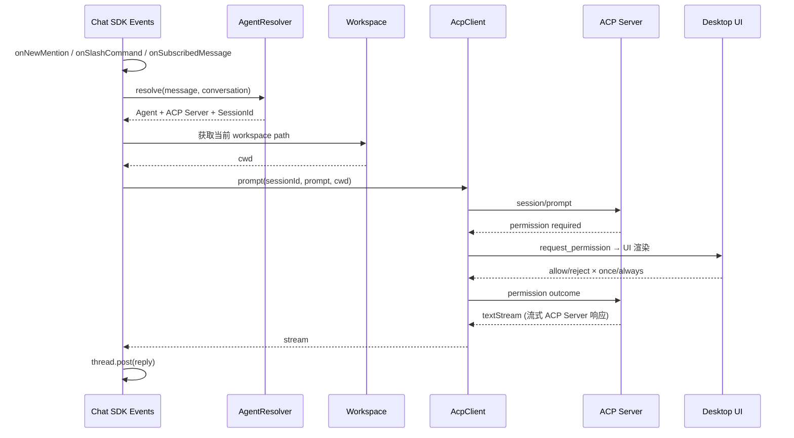
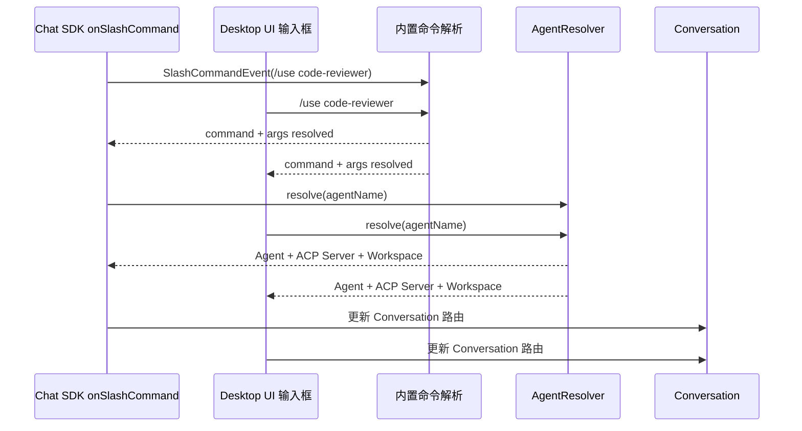
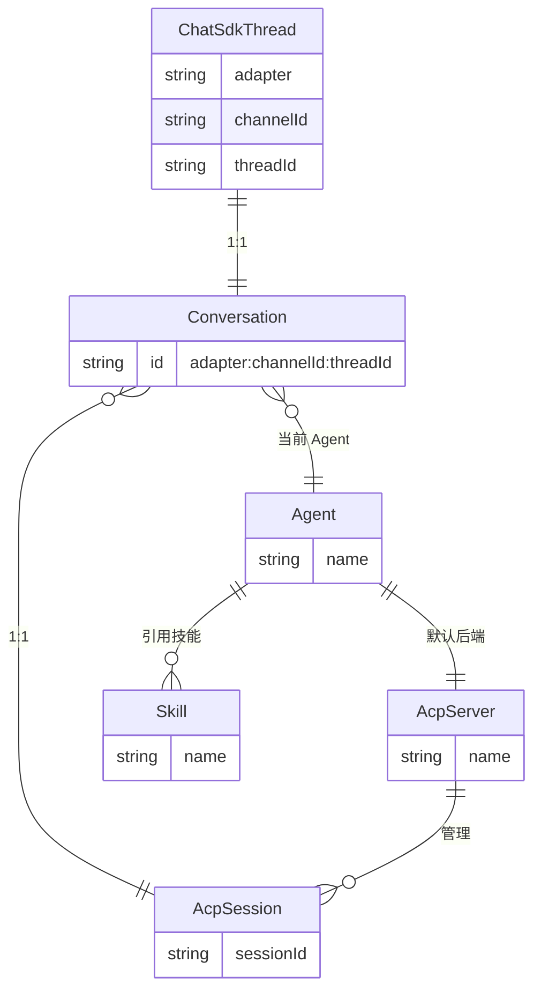

> **Status**: `draft`

# 架构总览：ACP-native Agent 编排层

## § 架构定位

AgentLink 的架构服务于产品蓝图（`docs/blueprint.md`），三条产品边界直接决定架构边界：

1. **ACP-native** — 不自研 Agent 执行运行时，所有 Agent 执行通过 ACP 协议调用用户配置的 ACP Server。AgentLink 管"谁处理、用什么 Skill、何时切换"，ACP Server 管"如何执行"。
2. **编排层** — 管理 Agent、Skill、会话状态和内置命令；不依赖任何特定 ACP Server 的内部配置。
3. **Messaging-native** — 通过 Chat SDK 把 Agent 接入 Feishu 等真实 IM 消息流；IM 渠道是场景，不是平台。

## § 核心概念

在本架构中，"Agent"这个词容易产生歧义——AgentLink 和 ACP 协议都用它，但含义完全不同。以下定义建立全文术语规范：

### Agent（AgentLink 概念）

**角色配置 + 系统提示**，不是执行运行时。一个 Agent 文件（`agents/*.md`）包含：系统提示正文（发给 ACP Server 的系统提示）、技能绑定、默认 ACP Server，以及模型偏好等元数据。

### ACP Server（ACP 协议概念）

**Agent 执行运行时**。接收 prompt、管理 session、执行工具调用、返回响应。AgentLink 不关心其内部实现，只通过 ACP 协议通信。存储和状态完全由 ACP Server 自身管理。

### 同一术语，不同语义

```
AgentLink 的 "Agent"           ACP 的 "Agent"
     │                              │
     角色配置 + 系统提示              执行运行时
     "谁、会什么、怎么做"             "怎么执行"
     System prompt + Skills          LLM + tools + sessions
          + ACP Server binding
```

文档全文遵循这个区分：**Agent** 始终指 AgentLink 的角色配置，ACP 侧统一用 **ACP Server** 指代执行运行时。

### 其他核心概念

| 概念 | 所属层 | 定义 |
|------|--------|------|
| **Skill** | AgentLink（文件 `skills/*.md`） | 能力标签，Markdown + YAML frontmatter，跨 Agent 复用 |
| **SlashCommand** | AgentLink（内置） | `/命令` 到 ACP 操作的映射，内置在 AgentLink 中，不支持用户自定义 |
| **Workspace** | AgentLink（文件 `workspaces.jsonc`） | 工作区目录，Agent 执行的文件系统边界。记录默认工作区和所有打开过的目录 |
| **Conversation** | AgentLink（SQLite `agentlink.db`） | IM Thread 到 ACP Session 的路由索引，运行时状态 |
| **ACP Session** | ACP 协议 | ACP Server 管理的一次**多轮对话**——从 `session/new` 到 `session/delete`，包含完整上下文、累积的工具调用和 mode/config 状态。一次 Session 不等于一问一答，而是整个对话生命周期 |

### 三层映射关系

一个 IM 线程、一条 Conversation 记录、一个活跃的 ACP Session——三者一一对应。

```
feishu:channel_abc:thread_123        ← IM 线程
  └─ Conversation (agentlink.db)     ← 路由记录
       └─ ACP Session (sess_abc123)  ← ACP Server 管理的多轮对话
            ├─ 用户: "审查这段代码"
            ├─ Agent: "发现 3 个问题..."
            ├─ 用户: "第二个怎么修？"  ← 同一 session，有上下文
            └─ Agent: "可以这样改..."
```

Agent 切换时（`/use`）fork 出新 session——新 session 继承旧 session 的上下文，Conversation 的 `acp_session_id` 指向新的。旧 session 留在 ACP Server 侧，不再被引用。

## § 三层能力模型

```
┌─────────────────────────────────────────────┐
│           Channel Adapter Layer              │
│  Chat SDK Adapters · Event Handlers          │
│  onNewMention / onSlashCommand / ...         │
│  Slack · Feishu · Discord · GitHub ...       │
├─────────────────────────────────────────────┤
│           Agent Control Layer                │
│  Agent（*.md）· Skill（*.md）                 │
│  Workspace（*.jsonc）· 内置命令               │
│  AgentResolver · Conversation（SQLite）       │
│  文件索引（chokidar 热更新）· 内部 Events     │
├─────────────────────────────────────────────┤
│           ACP Integration Layer              │
│  AcpClient · Session 映射 · Permission       │
│  setMode / setConfig · MCP Server 管理       │
└─────────────────────────────────────────────┘
```

三层均运行在 Electron Main 进程（Node.js），通过 Chat SDK 的 `Chat` 实例接入多渠道适配器，在事件回调中编排 Agent 解析和 ACP 调用。

- **Channel Adapter Layer**：基于 Chat SDK 的 Adapter 体系。Chat SDK 提供 Slack、Feishu、Discord、GitHub 等多平台适配器，处理 webhook 验签、消息解析、线程管理（`thread.subscribe()` / `thread.post()`）和事件分发（`onNewMention`、`onSubscribedMessage`、`onSlashCommand`、`onReaction` 等）。AgentLink 不重新实现协议适配逻辑。
- **Agent Control Layer**：AgentLink 自建层。用户创作的配置以文件存储（`agents/*.md`、`skills/*.md`、`acp-servers.jsonc`、`workspaces.jsonc`），运行时状态以 SQLite 存储（`agentlink.db`：Conversation 路由 + Chat SDK state）。启动时扫描文件构建内存索引，chokidar 热更新。
- **ACP Integration Layer**：通过 AcpClient 调用 ACP Server。AgentLink 管理 Server 生命周期（启动进程）。ACP 协议提供 session 生命周期管理、prompt 处理、permission 协商、mode/config 切换和 MCP Server 管理。AgentLink 不重新实现这些能力——AcpClient 负责协议通信，Permission Handler 渲染权限 UI，Mode/Config 映射转换内置命令。Chat SDK 的交互能力在此层编排中使用。

内部 Events（Node.js EventEmitter + oRPC streaming）用于模块间解耦——日志、审计、UI 状态推送。注意与 Chat SDK 的事件（外部 IM 入口）区分：Chat SDK 事件是入站消息来源，内部 Events 是进程内解耦手段。

## § 约束与部署

- AgentLink 全部业务逻辑运行在 Electron Main 进程内，不创建独立 daemon 或 sidecar。窗口关闭到托盘后（Electron Tray API）继续运行；用户显式退出（`app.quit()`）后停止。
- Desktop UI 通过 oRPC IPC 访问 Main 进程，不直接调用 Chat SDK、AgentResolver 或 Events 内部结构。
- 渠道适配、webhook 验签、消息格式化和线程管理由 Chat SDK 提供，AgentLink 不重新实现。
- Session 生命周期、Permission 协商、Mode/Config 切换由 ACP 协议提供，AgentLink 仅做命令映射和 UI 渲染，不另建 session 存储层或权限模型。
- AgentLink 用户创作的配置以文件存储（`agents/*.md`、`skills/*.md`、`acp-servers.jsonc`、`workspaces.jsonc`），可版本管理、编辑器直接修改。运行时状态（Conversation 路由、Chat SDK 线程订阅和 transcripts）以 SQLite 存储（`agentlink.db`）。
- Workspace 定义 Agent 执行的文件系统边界，作为 ACP session 的 `cwd` 传入。有默认工作区，可切换。
- 密钥通过 `electron.safeStorage` 加密存储（macOS Keychain / Windows DPAPI），配置文件中仅存引用 key。
- 打包分发通过 Electron Forge（Squirrel / ZIP / RPM / DEB + GitHub publisher）。
- 公网 Webhook 入口需要 Cloud Relay、tunnel 或用户自建 HTTPS endpoint。

## § 关键设计决策

| 决策问题 | 选择 | 放弃的替代方案 | 理由 |
|---------|------|--------------|------|
| AgentLink 是否自研 Agent 执行运行时？ | 不自研，复用用户 ACP Server | 自研 Agent 执行运行时 | 聚焦编排层，ACP Server 管执行，AgentLink 管编排 |
| 入站消息如何保序？ | Chat SDK 线程模型 + 回调内 FIFO | MessageBus 直连上下游 | Chat SDK 已提供 `onNewMention` / `onSubscribedMessage` / `onSlashCommand` 线程分发 |
| Agent 如何选择？ | 默认 Agent + SlashCommand 显式选择 | RouteRule 自动路由 | 显式命令比关键词规则更可解释 |
| v1 后台模型？ | Electron Main 进程内驻留 Chat SDK + Agent/ACP 逻辑 | 独立 OS daemon | Main 进程常驻满足托盘场景，无需额外进程 |
| IPC 实现方式？ | oRPC over MessagePort | ipcMain.handle / ipcRenderer.invoke | 类型安全、Zod 校验、middleware 上下文注入 |
| 凭证加密方案？ | electron.safeStorage | keytar 或明文 localStorage | 内置 Electron，OS 原生加密，无额外依赖 |
| 配置如何存储？ | 用户配置文件（`*.md`、`*.jsonc`），运行时状态走 SQLite（`agentlink.db`） | 全文件或全数据库 | 文件适合用户创作和版本管理；SQLite 适合频繁更新的运行时状态（Conversation、transcripts） |
| Session 管理由谁负责？ | ACP Session 生命周期（new/load/list/delete/resume） + AgentLink Conversation 轻量索引 | AgentLink 自建完整会话存储 | ACP 管 Agent 上下文，AgentLink 仅存"IM thread → ACP session"映射索引 |
| Conversation 三层映射如何设计？ | AgentLink Conversation 作为轻量路由索引（1 IM Thread : 1 Conversation : 1 ACP Session） | IM Thread 直连 ACP Session 无中间层 | Chat SDK 管消息、ACP 管上下文、AgentLink 管路由；一个 IM 线程只对应一个活跃 ACP Session |
| Permission 控制由谁负责？ | ACP `request_permission` + AgentLink 渲染 UI | AgentLink 自建权限模型 | ACP 提供 4 种权限选择（allow/reject × once/always），AgentLink 只需渲染 |
| Workspace 如何管理？ | 单个 `workspaces.jsonc` 文件，记录默认工作区和打开历史 | 每个 workspace 独立文件或存数据库 | 工作区列表是扁平数据，单文件足够；Desktop UI 展示历史列表供快速切换 |
| Mode/Config 切换如何实现？ | SlashCommand → ACP `setSessionMode` / `setSessionConfigOption` | AgentLink 自建 mode/config 状态机 | ACP 已定义 mode 切换和 config 选项机制，AgentLink 做命令映射即可 |

## § 边界划分

```
Electron App
  ├─ Main Process (Node.js)
  │    ├─ App lifecycle
  │    ├─ oRPC Server（over MessagePort）
  │    │    ├─ rpcHandler.upgrade(serverPort)
  │    │    ├─ IPC context（BrowserWindow 引用 → oRPC middleware）
  │    │    └─ Router（theme / window / app / shell / agent / channel / ...）
  │    ├─ Chat SDK `Chat` 实例（多渠道适配器编排）
  │    │    ├─ Adapters（Slack / Feishu / Discord / GitHub ...）
  │    │    ├─ Event Handlers（onNewMention / onSubscribedMessage / onNewMessage
  │    │    │      onSlashCommand / onReaction / onAssistantThreadStarted
  │    │    │      onAppHomeOpened / onModalSubmit / onAction）
  │    │    ├─ Webhook handler（验签 + 消息解析）
  │    │    ├─ Thread（`subscribe()` / `post()` / `textStream`）
  │    │    └─ Interactive（`openModal()` / `postEphemeral()`）
  │    ├─ Agent Control Layer
  │    │    ├─ Agent（agents/*.md）+ Skill（skills/*.md）
  │    │    ├─ Workspace（workspaces.jsonc）+ 内置命令
  │    │    ├─ AgentResolver · Conversation（agentlink.db）
  │    │    ├─ 文件索引（chokidar 监听 2 个目录）
  │    │    └─ 内部 Events（Node.js EventEmitter，模块解耦）
  │    ├─ ACP Integration Layer
  │    │    ├─ AcpClient（ACP 协议客户端）
  │    │    ├─ AcpServerRegistry（ACP Server 连接配置管理）
  │    │    ├─ Conversation 路由索引（IM Thread ↔ ACP Session）
  │    │    ├─ Prompt 转发（Chat SDK 消息 → ACP prompt）
  │    │    ├─ Permission Handler（`request_permission` → UI 渲染）
  │    │    ├─ Mode / Config 映射（SlashCommand → ACP setMode/setConfig）
  │    │    └─ Stream 转发（ACP 流式响应 → thread.post textStream）
  │    ├─ Storage
  │    │    ├─ agentlink.db（Conversation 路由 + Chat SDK state + transcripts）
  │    │    ├─ workspaces.jsonc（工作区列表：默认 + 打开历史）
  │    │    ├─ agents/*.md（Agent 定义）
  │    │    ├─ skills/*.md（Skill 定义文件）
  │    │    ├─ acp-servers.jsonc（ACP Server 配置）
  │    │    └─ safeStorage（密钥加密存储）
  │    ├─ Tray（窗口关闭后维持 Main 进程运行）
  │    └─ Auto-updater（update-electron-app）
  │
  ├─ Preload Script（contextIsolation 桥接）
  │    └─ MessagePort 转发：window.postMessage ↔ ipcRenderer.postMessage
  │
  └─ Renderer Process（BrowserWindow / Chromium）
       ├─ React App（TanStack Router + TanStack Query + shadcn-ui）
       ├─ IPC Manager（oRPC client over MessagePort → ipc.client）
       └─ Actions Layer（ipc.client.<domain>.<method>() 薄封装）
```

## § IPC 模式

项目已有的 oRPC over MessagePort 模式（当前 `theme`、`window`、`app`、`shell`）自然映射到新领域：

```
src/ipc/
  ├─ theme/   window/   app/   shell/     ✓ 已实现
  ├─ agent/         — Agent 文件管理（CRUD agents/*.md）, AgentResolver（全内存）
  ├─ channel/       — Chat SDK 适配器启用/禁用, 配置
  ├─ conversation/  — Conversation 路由索引（agentlink.db，IM Thread → ACP Session 映射）
  ├─ slashcommand/  — 内置命令解析（/use /skill /workspace /mode /model /default → ACP 操作）
  ├─ workspace/     — Workspace 管理（读写 workspaces.jsonc，切换工作区）
  ├─ acp/           — AcpServer 管理（读写 acp-servers.jsonc）, 生命周期管理（启动/停止）, AcpClient, session 管理, permission UI, mode/config
  ├─ file-index/    — 2 个目录文件扫描、解析、内存索引、chokidar 热更新、引用校验
  └─ events/        — Events 流式订阅（oRPC streaming）
```

每个领域遵循统一结构：`index.ts`（导出分组）、`handlers.ts`（`os.handler()` 过程定义）、`schemas.ts`（Zod 校验）。Renderer 侧通过 `src/actions/<domain>.ts` 调用 `ipc.client.<domain>.<method>()`。

## § 核心流程

### 主流程：渠道消息 → Agent 解析 → ACP Server → 渠道回复

Chat SDK 的事件回调中执行的编排逻辑。入口可以是 `onNewMention`（@提及）、`onSubscribedMessage`（已订阅线程消息）或 `onSlashCommand`（内置命令），进入后统一步入 AgentResolver → ACP prompt 流程。ACP Server 负责 session 管理、prompt 执行、permission 协商和 mode 切换。当前 workspace 路径作为 `cwd` 传入 ACP session。



### SlashCommand 选择流程

SlashCommand 有两个入口：IM 渠道通过 Chat SDK 的 `onSlashCommand` 事件进入，Desktop UI 通过输入框直接进入。内置命令（`/help`、`/use`、`/skill`、`/mode`、`/model`、`/workspace`、`/default`）在 Agent Control Layer 中解析后执行对应操作。



### 三层存储边界

AgentLink 位于 Chat SDK 和 ACP 之间，关键是**不重复存储任何一方已有的数据**。

| | Chat SDK Thread | AgentLink Conversation | ACP Session |
|---|---|---|---|
| **存什么** | 线程订阅、transcripts（消息历史）、去重缓存 | **路由映射**（IM Thread → ACP Session）+ 当前 Agent/Workspace | 对话历史（系统提示、工具调用、计划、思考过程）、MCP 连接、mode、config |
| **持久性** | 订阅持久（SQLite state adapter） | SQLite，无 TTL | ACP Server 管理，无 TTL |
| **重启后** | 自动恢复线程订阅 + transcripts | 从 agentlink.db 恢复路由 → `session/resume` | 恢复上下文（不重放历史） |
| **AgentLink 读** | 收消息、`bot.transcripts.list()` 查历史 | 读写路由 | 创建/加载/resume session |
| **AgentLink 不读** | — | — | 不解析 session 内部历史（系统提示、工具调用、计划等由 ACP Server 管理） |

**设计原则**：
- Chat SDK 管消息通道和消息存储——transcripts 按用户持久化消息历史，AgentLink 不另建消息存储
- ACP 管 Agent 记忆——对话上下文、mode、config 全在 ACP Session 里，AgentLink 只管创建和引用
- AgentLink 管路由——Conversation 是"谁（IM 线程）→ 发到哪（ACP Session）+ 用什么身份（Agent）+ 在哪干活（Workspace）"的最小映射

### 核心实体关系

AgentLink 的实体分三层：**外部引用**（Chat SDK Thread、ACP Session，AgentLink 不存储其内容）、**路由索引**（Conversation，SQLite 存储）、**配置管理**（Agent、Skill、AcpServer，文件存储）。



字段定义见 § 数据模型（文件格式和表结构）。

## § 数据模型

### 存储策略

用户创作的**配置**以文件存储（可编辑、可版本管理），系统生成的**运行时状态**以 SQLite 存储（频繁更新、需要索引查询）。SQLite 同时作为 Chat SDK 的 state adapter，承担线程订阅和 transcripts 消息历史的持久化。

```
{userData}/
  ├─ agentlink.db             # SQLite  Conversation 路由 + Chat SDK state
  ├─ workspaces.jsonc         # 工作区列表（默认 + 打开历史）
  ├─ agents/                  # *.md  Agent 定义
  ├─ skills/                  # *.md  能力定义
  ├─ acp-servers.jsonc         # ACP Server 连接配置
  └─ safeStorage              # OS 原生加密  密钥
```

| 存储 | 实体 | 格式 | 理由 |
|------|------|------|------|
| `agentlink.db` | Conversation、transcripts、线程订阅 | SQLite | 运行时状态，频繁更新；Chat SDK state adapter 后端 |
| `workspaces.jsonc` | Workspace | JSONC | 用户配置，编辑器直接修改 |
| `agents/*.md` | Agent | Markdown + YAML frontmatter | 用户创作，系统提示 + 技能绑定 + 模型偏好 |
| `skills/*.md` | Skill | Markdown + YAML frontmatter | 用户创作，能力定义 |
| — | SlashCommand | 内置（硬编码） | 命令固定 |
| `acp-servers.jsonc` | AcpServer | JSONC | 用户配置，所有 Server 在一个文件中 |
| `safeStorage` | 密钥 | OS 原生加密 | 凭证和 secret |

消息内容由 Chat SDK transcripts 存储（`agentlink.db` 中），AgentLink 不另建消息存储。ACP Session 上下文由 ACP Server 管理。

### 文件格式

所有 Markdown 文件遵循统一模式：YAML frontmatter 定义结构化元数据，正文是自由文本内容。JSONC 文件用于纯结构化配置。

#### Agent 文件（`agents/*.md`）

Agent 文件**本身就是系统提示**——frontmatter 定义元数据和绑定关系，正文是发给 ACP Server 的系统提示。

```markdown
---
name: code-reviewer
description: 代码审查专家，审查代码的安全、性能和可维护性
skills:
  - review
  - summarize
defaultAcpServer: auggie
model: sonnet
effort: medium
disallowedTools:
  - Write
  - Edit
---

你是一位资深代码审查者。你的审查风格：

- 优先关注安全漏洞和性能问题
- 对命名和代码结构提出改进建议
- 使用中文回复，但代码引用保持原文
- 每条建议都附带理由和修改示例

## 审查清单

1. 安全性：SQL 注入、XSS、权限绕过、密钥泄露
2. 性能：N+1 查询、不必要的重渲染、大循环中的重复计算
3. 可维护性：命名一致性、函数长度、圈复杂度、重复代码
```

| 字段 | 类型 | 必填 | 说明 |
|------|------|------|------|
| `name` | string | 是 | 机器可读名称，`/use` 命令通过此名称引用 |
| `description` | string | 是 | 一句话描述，Desktop UI 列表展示用 |
| `skills` | string[] | 是 | 引用 `skills/*.md` frontmatter 的 `name` 列表 |
| `defaultAcpServer` | string | 是 | 引用 `acp-servers.jsonc` 中 `servers` 的 key |
| `model` | string | 否 | 模型偏好，传给 ACP Server（如 `sonnet`、`opus`） |
| `effort` | string | 否 | 推理力度：`low` / `medium` / `high` / `xhigh` / `max` |
| `disallowedTools` | string[] | 否 | 禁用的工具列表 |

正文完整传给 ACP Server 作为 system prompt。

#### Skill 文件（`skills/*.md`）

```markdown
---
name: review
description: 代码审查技能
---

## 审查维度

1. 安全性：SQL 注入、XSS、权限绕过
2. 性能：N+1 查询、不必要的重渲染
3. 可维护性：命名、函数长度、重复代码

## 工具权限

- read_file: allow
- write_file: ask
- execute_command: deny
```

| 字段 | 类型 | 必填 | 说明 |
|------|------|------|------|
| `name` | string | 是 | 机器可读名称，Agent 文件通过此名称引用 |
| `description` | string | 是 | 一句话描述，Desktop UI 列表展示用 |

正文包含能力描述、审查维度、工具权限等，AgentLink 将其作为 prompt 上下文的一部分传给 ACP Server。

### Workspace 文件（`workspaces.jsonc`）

单文件记录默认工作区和所有打开过的目录。AgentLink 读写此文件维护打开历史，Desktop UI 展示列表供用户快速切换。

```jsonc
{
  // 默认工作区路径
  "default": "/Users/zhuxining/Code/my-project",
  // 所有打开过的工作区
  "opened": [
    {
      "path": "/Users/zhuxining/Code/my-project",
      "name": "my-project",
      "lastOpenedAt": "2026-06-28T10:00:00Z"
    },
    {
      "path": "/Users/zhuxining/Code/oss-contrib",
      "name": "oss-contrib",
      "lastOpenedAt": "2026-06-27T15:00:00Z"
    }
  ]
}
```

| 字段 | 类型 | 必填 | 说明 |
|------|------|------|------|
| `default` | string | 是 | 默认工作区路径 |
| `opened` | array | 是 | 所有打开过的工作区列表 |
| `opened[].path` | string | 是 | 工作区绝对路径，作为 ACP `session/new` 的 `cwd` |
| `opened[].name` | string | 是 | 显示名称，`/workspace` 命令通过此名称切换 |
| `opened[].lastOpenedAt` | string | 是 | ISO 8601，用于排序历史列表 |

### 内置命令

AgentLink 的命令是内置的（硬编码），不支持用户自定义。所有命令以 `/` 开头。

| 命令 | 格式 | 说明 | 对应的 ACP 调用 |
|------|------|------|----------------|
| `/help` | `/help` | 显示所有可用命令和 Agent 列表 | —（本地展示） |
| `/use <agent>` | `/use code-reviewer` | 切换到指定 Agent | 同 Server：`session/fork`；跨 Server：`session/new` |
| `/skill <skill>` | `/skill review` | 将指定 Skill 上下文附加到本条 prompt | 消息级，不改变会话状态 |
| `/mode <mode>` | `/mode code` | 切换 ACP Server 工作模式 | `setSessionMode(sessionId, mode)` |
| `/model <model>` | `/model opus` | 切换模型 | `setSessionConfigOption(sessionId, "model", model)` |
| `/workspace <name>` | `/workspace oss-contrib` | 切换到指定工作区 | 更新当前 workspace path，后续 session 以新路径为 `cwd` |
| `/default` | `/default` | 恢复到默认 Agent | 切换到默认 Agent + 默认工作区 |

命令解析在 Agent Control Layer 中执行，`/use` 和 `/skill` 的参数会与内存索引中的 Agent/Skill `name` 做匹配。

#### AcpServer 文件（`acp-servers.jsonc`）

单文件记录所有 ACP Server，启动时读到内存。AgentLink 负责各 Server 的启动和停止。

```jsonc
{
  "servers": {
    "auggie": {
      "command": "npx",
      "args": ["-y", "@augmentcode/auggie@0.31.0", "--acp"],
      "description": "Augment Code 的 ACP Agent"
    },
    "hermes": {
      "command": "hermes",
      "args": ["acp"],
      "description": "Hermes ACP Agent"
    }
  }
}
```

| 字段 | 类型 | 必填 | 说明 |
|------|------|------|------|
| `name` | string | 是 | 机器可读名称，即 `servers` 的 key，Agent 文件通过此名称引用 |
| `command` | string | 是 | 启动命令 |
| `args` | string[] | 是 | 命令参数 |

### 文件索引机制

AgentLink 启动时扫描 2 个目录（agents/、skills/），解析所有文件构建内存索引。chokidar 监听变更保持热更新。`workspaces.jsonc` 和 `acp-servers.jsonc` 为单文件，启动时直接读取。

```
启动流程:
1. 连接 agentlink.db
2. 读取 workspaces.jsonc → 获取默认工作区
3. 读取 acp-servers.jsonc → Map<name, AcpServer>
4. 扫描文件目录 → 解析 → 内存索引:
   ├─ agents/*.md → Map<name, Agent>
   └─ skills/*.md → Map<name, Skill>
5. 校验引用完整性
6. 启动 chokidar 监听 agents/ + skills/ 目录
7. Chat SDK 通过 SQLite state adapter 自动恢复订阅 + transcripts
8. 命令解析（内置） + AgentResolver 查询:
   ├─ /use <name> → Agent 索引
   └─ 组装 prompt: Agent 正文 + Skill 正文 + transcripts 历史
```

**设计要点**：
- 文件是 source of truth，内存索引是运行时缓存，AgentLink 不写回文件
- Desktop UI 提供"在编辑器中打开"按钮
- 保存后 chokidar 自动检测，**即时生效，无需重启**
- 引用通过 `name` 字段而非文件名——用户可以重命名文件而不影响引用链
- 启动时做引用完整性校验，缺失引用记录日志警告但不阻塞启动

### 表结构（agentlink.db）

`agentlink.db` 承担两个角色：AgentLink 的 Conversation 路由存储 + Chat SDK 的 state adapter 后端。使用 `better-sqlite3`。

#### conversations

IM 会话到 ACP Session 的路由映射。Conversation 的核心操作是**更新**（Agent 切换、Workspace 切换、新建 ACP session），SQLite 的 UPDATE 直接定位到行。

| 列 | 类型 | 约束 | 说明 |
|----|------|------|------|
| `id` | TEXT | PK | `adapter:channelId:threadId`，唯一标识一条 IM 会话 |
| `acp_server_name` | TEXT | NOT NULL | 当前 ACP Server（对应 `acp-servers.jsonc` 中 `servers` 的 key） |
| `acp_session_id` | TEXT | NOT NULL | 当前 ACP Session ID（ACP Server 分配） |
| `agent_name` | TEXT | NOT NULL | 当前 Agent（对应 `agents/*.md` 的 `name`） |
| `workspace_name` | TEXT | NOT NULL | 当前工作区（对应 `workspaces.jsonc` 的 `name`） |
| `created_at` | TEXT | NOT NULL | ISO 8601 |

#### transcripts

Chat SDK state adapter 的消息存储表。由 Chat SDK 的 `bot.transcripts.append()` / `list()` / `delete()` 驱动，AgentLink 不直接写入。

| 列 | 类型 | 约束 | 说明 |
|----|------|------|------|
| `user_key` | TEXT | NOT NULL | 跨平台用户标识（identity resolver 返回） |
| `id` | TEXT | PK | UUID，Chat SDK append 时分配 |
| `role` | TEXT | NOT NULL | `user` / `assistant` / `system` |
| `text` | TEXT | NOT NULL | 纯文本内容 |
| `platform` | TEXT | NOT NULL | 来源适配器（feishu / slack / ...） |
| `thread_id` | TEXT | NOT NULL | 来源线程 ID |
| `platform_message_id` | TEXT | | IM 平台原生消息 ID |
| `timestamp` | INTEGER | NOT NULL | 毫秒时间戳 |
| `formatted` | TEXT | | mdast AST，仅 `storeFormatted: true` 时存储 |

**索引**：`(user_key, timestamp)` —— Chat SDK 的 `getList` 按此顺序查询。

Chat SDK 的 `appendToList` / `getList` / `delete` 三个原语映射到该表的 INSERT / SELECT / DELETE，`maxPerUser` 通过 COUNT + 淘汰旧行实现，`retention` TTL 通过 `appendToList` 时刷新过期时间戳。

#### 线程订阅

由 Chat SDK state adapter 自动管理，AgentLink 无需关心其表结构。

### 数据流：首次消息到回复

```
1. Chat SDK 事件 (onNewMention / onSlashCommand / onSubscribedMessage)
   ↓ adapter, channelId, threadId
2. 查找 Conversation（WHERE id = adapter:channelId:threadId）
   ├─ 不存在 → 新建 Conversation + ACP session/new + INSERT INTO conversations
   └─ 存在 → 获取 acp_session_id
3. 命令解析（内置）
   ├─ /use <name> → Agent 索引查找 → 同 Server: session/fork; 跨 Server: session/new → UPDATE conversations SET agent_name, acp_server_name, acp_session_id
   ├─ /skill <name> → Skill 索引查找 → 附加到本条 prompt（消息级，不改变会话状态）
   ├─ /workspace <name> → workspaces.jsonc 查找 → UPDATE conversations SET workspace_name = ?
   ├─ /mode <mode> → ACP setSessionMode
   └─ /model <model> → ACP setSessionConfigOption
4. 组装 prompt 上下文（全内存）
   ├─ Agent 索引 → 系统提示正文 + skill names + defaultAcpServer name
   ├─ Workspace path → ACP session cwd
   └─ Skill 索引 → 能力正文
5. ACP session/prompt(sessionId, prompt, cwd=workspacePath)
   ├─ request_permission → AgentLink UI 渲染 → 用户选择 → ACP permission outcome
   └─ textStream → thread.post(reply)
```

## § 安全

- **进程隔离**：`contextIsolation: true` 将 Renderer 与 Node.js 完全隔离；Preload 只做 MessagePort 转发；`RunAsNode` Fuse 已禁用。
- **密钥**：渠道凭证通过 `electron.safeStorage`（macOS Keychain / Windows DPAPI）加密存储；Renderer 无法直接访问。
- **信任边界**：oRPC IPC 是外部进入系统的唯一入口，所有请求经过 Zod schema 校验。
- **渠道安全**：外部 Webhook 校验渠道签名或共享密钥；公网入口必须经过 HTTPS endpoint。
- **权限控制**：ACP Server 发起的本地工具调用经过 `request_permission` 流程，由 AgentLink 渲染权限 UI 获取用户授权。

## § 文档关联

- 产品蓝图：`docs/blueprint.md`
